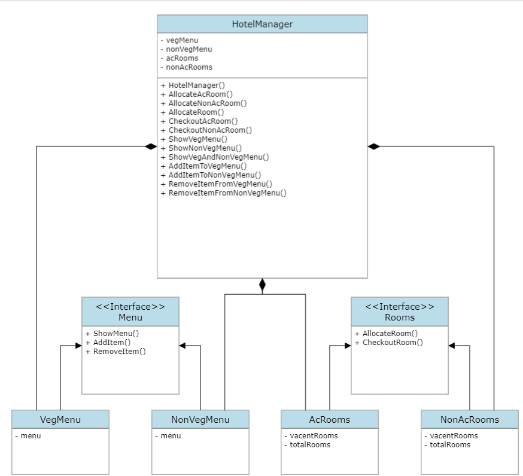

# FacadeDesignPattern

The Facade design pattern is a structural design pattern that provides a simplified interface to a complex system of classes, interfaces, or subsystems. It is part of the Gang of Four (GoF) design patterns and is used to hide the complexities of a system and provide a unified and more straightforward interface to clients.

The key idea behind the Facade pattern is to create a single class (or a set of related classes) that serves as an entry point to a subsystem, shielding the client code from the details of how the subsystem works. This simplifies client code, reduces dependencies, and makes the system more manageable.

Here's how the Facade pattern typically works:

Subsystems: There is a complex system or set of classes/interfaces that perform various tasks within an application.

Facade: A Facade class is created, which encapsulates the interactions and complexities of the subsystem. It provides a high-level, simplified interface for the client to access the subsystem's functionality.

Client: Client code interacts with the Facade class rather than directly with the subsystem. This makes the client code cleaner and easier to understand, as it doesn't need to know the inner workings of the subsystem.

# Design

